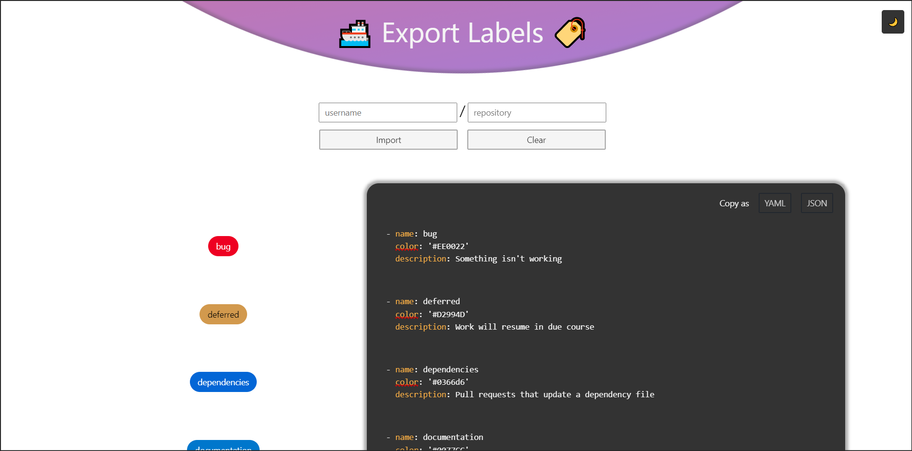

# Export Labels 🏷

A simple site to take the labels of any repository and export them as `yaml` or `json` arrays.

This was built to be used with [**label-sync**](https://github.com/Shresht7/label-sync-action) GitHub action.